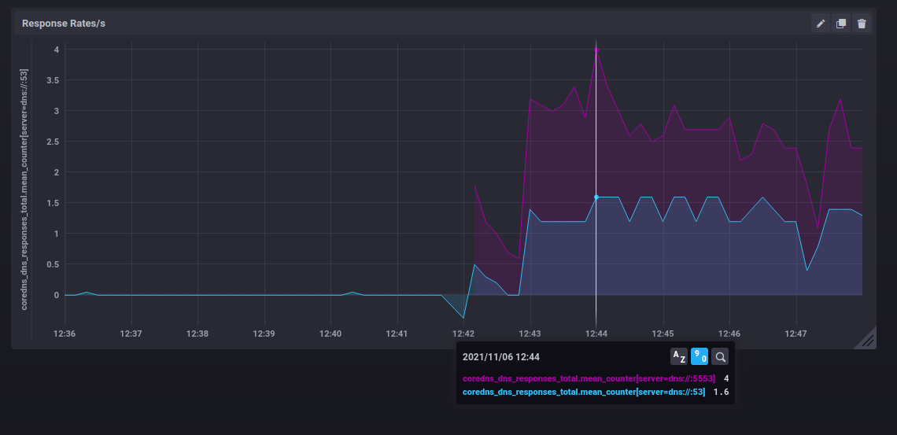
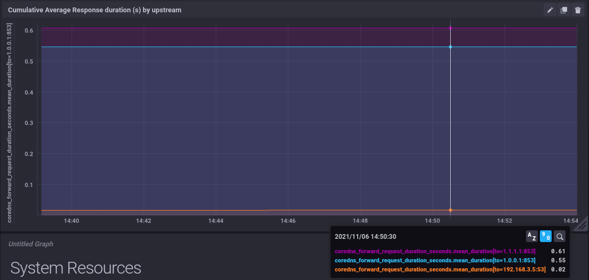
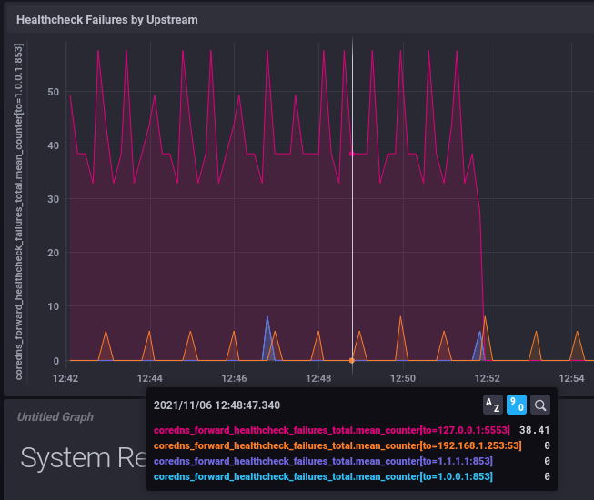

## Example setup - Monitoring CoreDNS


The reason I created this add-on is I wanted to be able to chart out the performance difference between hassio-DNS's default habit of using Cloudflare and not (using my override plugin made things feel faster, wanted to prove that was the case).

So, using my [core-dns-override](https://github.com/bentasker/HomeAssistantAddons/tree/master/core-dns-override) plugin, I enabled the Prometheus endpoint in CoreDNS:

    .:53 {
        log {
            class error
        }
        errors
        loop

        hosts /config/hosts {
            fallthrough
        }
        template ANY AAAA local.hass.io hassio {
            rcode NOERROR
        }
        mdns
        forward . dns://192.168.1.253 dns://127.0.0.1:5553 {
            except local.hass.io
            policy sequential
            health_check 1m
        }
        fallback REFUSED,SERVFAIL,NXDOMAIN . dns://127.0.0.1:5553
        prometheus 0.0.0.0:9153
        cache 600
    }

    .:5553 {
        log {
            class error
        }
        errors

        forward . tls://1.1.1.1 tls://1.0.0.1  {
            tls_servername cloudflare-dns.com
            except local.hass.io
            health_check 5m
        }
        prometheus 0.0.0.0:9153
        cache 600
    }
    
Then, I created my telegraf configuration in `/config/telegraf.conf`

    [agent]
    interval = "10s"
    round_interval = true
    metric_batch_size = 300
    metric_buffer_limit = 5000
    collection_jitter = "0s"
    flush_interval = "20s"
    flush_jitter = "0s"
    precision = ""
    debug = false
    quiet = false
    logfile = ""
    hostname = "home-assistant"
    omit_hostname = false

    [[inputs.diskio]]
    [[inputs.mem]]
    [[inputs.net]]
    [[inputs.swap]]
    [[inputs.system]]
    [[inputs.cpu]]
    ## Whether to report per-cpu stats or not
    percpu = true
    ## Whether to report total system cpu stats or not
    totalcpu = true
    ## If true, collect raw CPU time metrics.
    collect_cpu_time = false
    ## If true, compute and report the sum of all non-idle CPU states.
    report_active = false

    
    [[inputs.prometheus]]
    ## An array of urls to scrape metrics from.
    urls = ["http://hassio_dns:9153/metrics"]  


    [[outputs.influxdb]]
    urls = ["http://192.168.3.84:8086"]
    database = "home_assistant_performance"

Within a few seconds, data started appearing in InfluxDB, the measurement we're most interested in is `coredns_dns_request_duration_seconds` - there's a tag for each of the server blocks:


We can then trivially graph out how many responses the fallback is sending a second


(this is with a forced failure to ensure it's used)

We can also graph out reponse times for that fallback, and see that it is *very* slow to fail queries (Cloudflare is blocked at the firewall in this graph)


Although artificially blocked here, that clearly translates to very slow response times if there are issues between HomeAssistant and Cloudflare - essentially blocking execution of automations etc.

With Cloudflare unblocked, we can see that it's still significantly slower than local



CF's responses take around 500ms longer than the local DNS server - that's an additional half second lag when running scripts/automations which require an external name to be (re)resolved.

A ping to `1.1.1.1` shows a RTT of 10 - 13ms, so the additional latency is probably attributable to the overheads of DoT. Although the user's observed latency may also be increased by the inter-coreDNS communication (there's a UDP communication between the server block on `:53` and the one on `:5553`), it's not included in the graphed statistic.

Whatever the cause, where queries are passed to Cloudflare erroneously, latency is *25x* higher, even before the impact of passing local names to Cloudflare is taken into account.

### Impact of Healthchecks

Looking at healthcheck failure rates, we can see how the coredns configuration inadvertantly contributes to the packet storms some users have complained of



We can see lots and lots of failures against `127.0.0.1:5553`, despite it not being supposed to be used as an actual upstream.

The reason is that the default HomeAssistant config contains this:

```
        forward . dns://192.168.1.253 dns://127.0.0.1:5553 {
            except local.hass.io
            policy sequential
            health_check 1m
        }
```

It's therefore considered an upstream and will receive a healthcheck every 1 minute. This _clearly_ wasn't desired by the devs because they set the fallback healthcheck interval at 5m:

```
        forward . tls://1.1.1.1 tls://1.0.0.1  {
            tls_servername cloudflare-dns.com
            except local.hass.io
            health_check 5m
        }
```

The result is that when conneectivity to Cloudflare fails, an unexpectedly large number of healthchecks fail.

